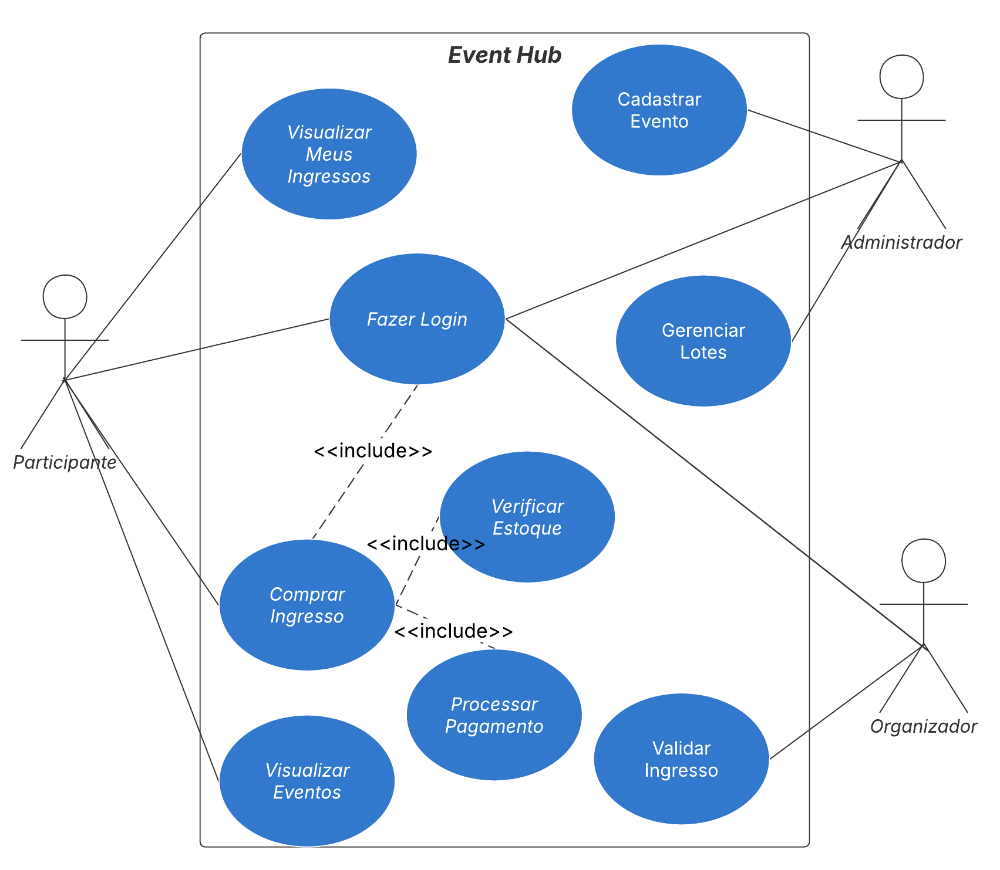
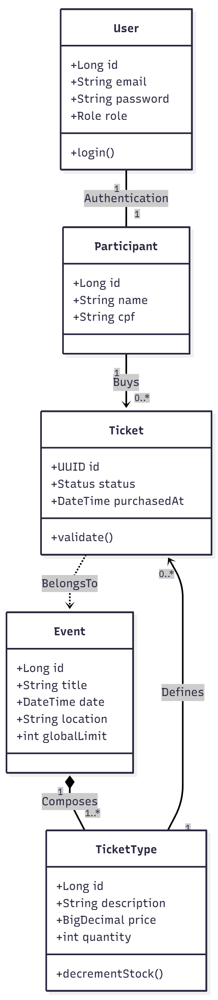
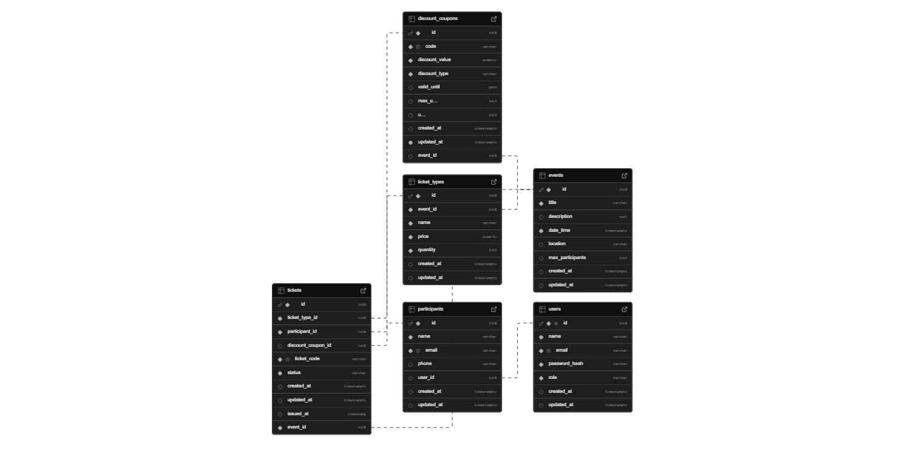

# EventHub

Um sistema completo para gerenciamento de eventos, permitindo controle
de participantes, vendas, pagamentos e validação de ingressos. O
EventHub foi desenvolvido utilizando **Spring Boot** no backend e
**Flutter** no frontend, proporcionando alto desempenho, organização e
escalabilidade.

------------------------------------------------------------------------

## 🚀 Funcionalidades Principais

### 🎟️ Gestão de Eventos

-   Criação e edição de eventos.
-   Upload de banner e informações detalhadas.

### 👤 Gestão de Usuários

-   Cadastro e autenticação.
-   Perfis com permissões diferentes (Administrador, Organizador e
    Participante).

### 📱 Aplicação de Check-in (Scanner)

-   Validação de ingressos via **QR Code**(feature).

### 🏷️ Sistema de Autenticação (opcional)
- JWT ou sessão simples (configurável futuramente).

### 📊 Dashboard (feature)

-   Visualização de estatísticas em tempo real:
    -   Total de vendas
    -   Faturamento

------------------------------------------------------------------------

## 🛠️ Tecnologias Utilizadas

### 🔹 **Backend**

-   Java 21+
-   Spring Boot
-   Spring Security + JWT
-   Spring Data JPA (Hibernate)
-   Banco de dados PostgreSQL
-   Lombok

### 🔹 **Frontend**

- Flutter
- Dart
- HTTP package
- Provider / Riverpod (dependendo da sua escolha)

### 🔹 **Outros Serviços**

-   Docker
-   QR Code Generator
-   API de validação via endpoint seguro(feature).

### 🔹 **Banco de Dados**
- PostgreSQL hospedado no **Supabase**


------------------------------------------------------------------------

## 📂 Estrutura do Projeto

    project-root
	├── src
	│   └── main
	│       └── java
	│           └── com
	│               └── eventhub
	│                   ├── EventHubApplication.java
	│                   ├── advice
	│                   │   └── GlobalExceptionHandler.java
	│                   ├── config
	│                   │   ├── JwtAuthenticationFilter.java
	│                   │   └── SecurityConfig.java
	│                   ├── controllers
	│                   │   ├── AuthController.java
	│                   │   ├── DiscountCouponController.java
	│                   │   ├── EventController.java
	│                   │   ├── ParticipantController.java
	│                   │   ├── TicketController.java
	│                   │   └── UserController.java
	│                   ├── dto
	│                   │   ├── BuyTicketRequestDTO.java
	│                   │   ├── LoginRequestDTO.java
	│                   │   ├── LoginResponseDTO.java
	│                   │   ├── PasswordChangeRequestDTO.java
	│                   │   ├── TicketValidationRequestDTO.java
	│                   │   ├── TicketValidationResponseDTO.java
	│                   │   └── UserResponseDTO.java
	│                   ├── entities
	│                   │   ├── DiscountCoupon.java
	│                   │   ├── Event.java
	│                   │   ├── Participant.java
	│                   │   ├── Ticket.java
	│                   │   ├── TicketType.java
	│                   │   ├── User.java
	│                   │   └── dto
	│                   │       ├── DiscountCouponDTO.java
	│                   │       ├── EventDTO.java
	│                   │       ├── ParticipantDTO.java
	│                   │       └── TicketDTO.java
	│                   ├── enums
	│                   │   ├── DiscountType.java
	│                   │   ├── Role.java
	│                   │   └── TicketStatus.java
	│                   ├── repository
	│                   │   ├── DiscountCouponRepository.java
	│                   │   ├── EventRepository.java
	│                   │   ├── ParticipantRepository.java
	│                   │   ├── TicketRepository.java
	│                   │   ├── TicketTypeRepository.java
	│                   │   └── UserRepository.java
	│                   └── services
	│                       ├── DiscountCouponService.java
	│                       ├── EventService.java
	│                       ├── ParticipantService.java
	│                       ├── TicketService.java
	│                       ├── TokenService.java
	│                       └── UserService.java


------------------------------------------------------------------------

## 🗄️ Modelagem do Banco de Dados

### Tabelas:
- `events`
- `participants`
- `tickets`
- `discount_coupons`

Chaves primárias, estrangeiras, relacionamentos e constraints completas para integridade.

------------------------------------------------------------------------

## 📚 Engenharia de Software

### Diagramas






### Modelo Lógico Relacional



**Notação:** `Tabela (<u>Chave Primária</u>, Atributo, Chave Estrangeira)`

---

#### `USERS`
- <u>`id`</u> (Chave Primária)
- `name`
- `email`
- `password_hash`
- `role`
- `created_at`
- `updated_at`

---

#### `EVENTS`
- <u>`id`</u> (Chave Primária)
- `title`
- `description`
- `date_time`
- `location`
- `max_participants`
- `created_at`
- `updated_at`

---

#### `TICKET_TYPES`
- <u>`id`</u> (Chave Primária)
- `name`
- `price`
- `quantity`
- <u>`event_id`</u> (Chave Estrangeira)
  - Referencia `EVENTS(id)`
- `created_at`
- `updated_at`

---

#### `PARTICIPANTS`
- <u>`id`</u> (Chave Primária)
- `name`
- `email`
- `phone`
- <u>`user_id`</u> (Chave Estrangeira)
  - Referencia `USERS(id)`
- `created_at`
- `updated_at`

---

#### `DISCOUNT_COUPONS`
- <u>`id`</u> (Chave Primária)
- `code`
- `discount_value`
- `discount_type`
- `valid_until`
- `max_uses`
- `uses`
- <u>`event_id`</u> (Chave Estrangeira)
  - Referencia `EVENTS(id)`
- `created_at`
- `updated_at`

---

#### `TICKETS`
- <u>`id`</u> (Chave Primária)
- `ticket_code`
- `status`
- `issued_at`
- <u>`ticket_type_id`</u> (Chave Estrangeira)
  - Referencia `TICKET_TYPES(id)`
- <u>`participant_id`</u> (Chave Estrangeira)
  - Referencia `PARTICIPANTS(id)`
- <u>`event_id`</u> (Chave Estrangeira)
  - Referencia `EVENTS(id)`
- <u>`discount_coupon_id`</u> (Chave Estrangeira)
  - Referencia `DISCOUNT_COUPONS(id)`
- `created_at`
- `updated_at`


### Politicas de Segurança da Base


### Stored e Procedures / Triggers


------------------------------------------------------------------------

## ⚙️ Como Rodar o Projeto

### 🖥️ Backend (Spring Boot)

1. Instalar o **Java 17** e **Maven**
2. Configurar o `application.properties` com os dados do Supabase
3. Rodar:

```bash
mvn spring-boot:run
```

Ou pelo Eclipse:
```
Run As > Spring Boot App
```

------------------------------------------------------------------------

## 📄 Documentação de Metodologia Ágil

Documentação à parte inclui:
- Kanban (Trello)
- Sprint planning

------------------------------------------------------------------------

## 📜 Licença

Este projeto é livre para fins acadêmicos.
------------------------------------------------------------------------

## 👨‍💻 Autor

Projeto desenvolvido por **Edson Silveira**  
Time: **Single Thread**
